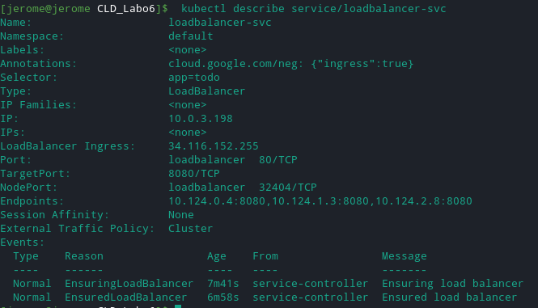

# Titre du laboratoire  : KUBERNETES

> Auteurs : Chris Barros, Jérôme Arn

# TASK 1 - DEPLOY THE APPLICATION ON A LOCAL TEST CLUSTER

> Document any difficulties  you faced and how you overcame them. Copy the object descriptions into the lab report.

Nous avons rencontré les problèmes suivants:

- ```sh
  # En voulant étendre le port du frontend sur le port 8001 avec la commande ci-dessous, nous avons remarqué que la page n'était pas joignable.
  kubectl port-forward pod/frontend 8080:8001
  # en changeant pour 
  kubectl port-forward pod/frontend 8080:8080
  # nous avons pu accéder à la page 
  ```

- La deuxième erreur que nous avons faite vient de la connexion entre le frontend et l'api. Nous avions mis la variable d'environnement à **api-svc:8081** au lieu de **http://api-svc:8081**.


objet du service api:

```sh
Name:              api-svc
Namespace:         default
Labels:            component=api
Annotations:       cloud.google.com/neg: {"ingress":true}
Selector:          app=todo,component=api
Type:              ClusterIP
IP Families:       <none>
IP:                10.0.12.57
IPs:               <none>
Port:              api  8081/TCP
TargetPort:        8081/TCP
Endpoints:         10.124.5.4:8081
Session Affinity:  None
Events:            <none>
```

pour l'objet frontend:

```sh
Name:         frontend
Namespace:    default
Priority:     0
Node:         minikube/192.168.49.2
Start Time:   Fri, 07 May 2021 04:20:28 +0200
Labels:       app=todo
              component=frontend
Annotations:  <none>
Status:       Running
IP:           172.17.0.5
IPs:
  IP:  172.17.0.5
Containers:
  frontend:
    Container ID:   docker://0f66ff0a8e7f6493592ae329006544c3faee9f8d4997ff83fe06f92dba8a58f1
    Image:          icclabcna/ccp2-k8s-todo-frontend
    Image ID:       docker-pullable://icclabcna/ccp2-k8s-todo-frontend@sha256:5892b8f75a4dd3aa9d9cf527f8796a7638dba574ea8e6beef49360a3c67bbb44
    Port:           8080/TCP
    Host Port:      0/TCP
    State:          Running
      Started:      Fri, 07 May 2021 04:24:16 +0200
    Ready:          True
    Restart Count:  0
    Limits:
      cpu:  300m
    Requests:
      cpu:  300m
    Environment:
      API_ENDPOINT_URL:  http://api-svc:8081
    Mounts:
      /var/run/secrets/kubernetes.io/serviceaccount from default-token-5pfrf (ro)
Conditions:
  Type              Status
  Initialized       True 
  Ready             True 
  ContainersReady   True 
  PodScheduled      True 
Volumes:
  default-token-5pfrf:
    Type:        Secret (a volume populated by a Secret)
    SecretName:  default-token-5pfrf
    Optional:    false
QoS Class:       Burstable
Node-Selectors:  <none>
Tolerations:     node.kubernetes.io/not-ready:NoExecute op=Exists for 300s
                 node.kubernetes.io/unreachable:NoExecute op=Exists for 300s
Events:
  Type    Reason     Age    From               Message
  ----    ------     ----   ----               -------
  Normal  Scheduled  12m    default-scheduler  Successfully assigned default/frontend to minikube
  Normal  Pulling    12m    kubelet            Pulling image "icclabcna/ccp2-k8s-todo-frontend"
  Normal  Pulled     8m27s  kubelet            Successfully pulled image "icclabcna/ccp2-k8s-todo-frontend" in 3m45.730749866s
  Normal  Created    8m27s  kubelet            Created container frontend
  Normal  Started    8m26s  kubelet            Started container frontend

```

```yaml
apiVersion: v1
kind: Service
metadata:
  labels:
    component: api
  name: api-svc
spec:
  ports:
  - port: 8081
    targetPort: 8081
    name: api
  selector:
    app: todo
    component: api
  type: ClusterIP
```

```yaml
apiVersion: v1
kind: Pod
metadata:
  name: frontend
  labels:
    component: frontend
    app: todo
spec:
  containers:
  - name: frontend
    image: icclabcna/ccp2-k8s-todo-frontend
    ports:
    - containerPort: 8080
    resources:
      limits:
        cpu: 300m
    env:
    - name: API_ENDPOINT_URL
      value: http://api-svc:8081
```


# TASK 2 - DEPLOY THE APPLICATION IN KUBERNETES ENGINE

```yaml
apiVersion: v1
kind: Service
metadata:
  labels:
    component: frontend
  name: frontend-svc
spec:
  selector:
    app: todo
  ports:
    - protocol: TCP
      port: 80
      targetPort: 8080
```

```sh
Name:              frontend-svc
Namespace:         default
Labels:            component=frontend
Annotations:       cloud.google.com/neg: {"ingress":true}
Selector:          app=todo
Type:              ClusterIP
IP Families:       <none>
IP:                10.0.11.136
IPs:               <none>
Port:              <unset>  80/TCP
TargetPort:        8080/TCP
Endpoints:         10.124.3.4:8080,10.124.4.3:8080,10.124.5.4:8080
Session Affinity:  None
Events:            <none>
```

```yaml
apiVersion: v1
kind: Service
metadata:
  name: loadbalancer-svc
spec:
  ports:
  - protocol: TCP
    port: 80
    targetPort: 8080
    name: loadbalancer
  selector:
    app: todo
  type: LoadBalancer
```

```sh
Name:                     loadbalancer-svc
Namespace:                default
Labels:                   <none>
Annotations:              cloud.google.com/neg: {"ingress":true}
Selector:                 app=todo
Type:                     LoadBalancer
IP Families:              <none>
IP:                       10.0.3.198
IPs:                      <none>
LoadBalancer Ingress:     34.116.152.255
Port:                     loadbalancer  80/TCP
TargetPort:               8080/TCP
NodePort:                 loadbalancer  32404/TCP
Endpoints:                10.124.3.4:8080,10.124.4.3:8080,10.124.5.4:8080
Session Affinity:         None
External Traffic Policy:  Cluster
Events:
  Type    Reason                Age                From                Message
  ----    ------                ----               ----                -------
  Normal  UpdatedLoadBalancer   56m (x2 over 56m)  service-controller  Updated load balancer with new hosts
  Normal  EnsuringLoadBalancer  51m                service-controller  Ensuring load balancer
  Normal  EnsuredLoadBalancer   51m                service-controller  Ensured load balancer
  Normal  UpdatedLoadBalancer   46m (x4 over 49m)  service-controller  Updated load balancer with new hosts
```




### Difficultés rencontrées 

Pour cette partie, aucune difficulté n'a été rencontrée.


# TASK 3 - ADD AND EXERCISE RESILIENCE

```yaml
apiVersion: apps/v1
kind: Deployment
metadata:
  name: frontend
  labels:
    component: frontend
    app: todo
spec:
  replicas: 2
  selector:
    matchLabels:
      component: frontend
      app: todo
  template:
    metadata:
      labels:
        component: frontend
        app: todo
    spec:
      containers:
      - name: frontend
        image: icclabcna/ccp2-k8s-todo-frontend
        ports:
        - containerPort: 8080
        resources:
          limits:
            cpu: 300m
        env:
        - name: API_ENDPOINT_URL
          value: http://api-svc:8081
```

```sh
Name:                   frontend
Namespace:              default
CreationTimestamp:      Tue, 25 May 2021 21:10:18 +0200
Labels:                 app=todo
                        component=frontend
Annotations:            deployment.kubernetes.io/revision: 1
Selector:               app=todo,component=frontend
Replicas:               2 desired | 2 updated | 2 total | 2 available | 0 unavailable
StrategyType:           RollingUpdate
MinReadySeconds:        0
RollingUpdateStrategy:  25% max unavailable, 25% max surge
Pod Template:
  Labels:  app=todo
           component=frontend
  Containers:
   frontend:
    Image:      icclabcna/ccp2-k8s-todo-frontend
    Port:       8080/TCP
    Host Port:  0/TCP
    Limits:
      cpu:  300m
    Environment:
      API_ENDPOINT_URL:  http://api-svc:8081
    Mounts:              <none>
  Volumes:               <none>
Conditions:
  Type           Status  Reason
  ----           ------  ------
  Available      True    MinimumReplicasAvailable
  Progressing    True    NewReplicaSetAvailable
OldReplicaSets:  <none>
NewReplicaSet:   frontend-7b6d9d4567 (2/2 replicas created)
Events:
  Type    Reason             Age    From                   Message
  ----    ------             ----   ----                   -------
  Normal  ScalingReplicaSet  2m36s  deployment-controller  Scaled up replica set frontend-7b6d9d4567 to 2
```


```yaml
apiVersion: apps/v1
kind: Deployment
metadata:
  name: api
  labels:
    component: api
    app: todo
spec:
  replicas: 2
  selector:
    matchLabels:
      component: api
      app: todo
  template:
    metadata:
      labels:
        component: api
        app: todo
    spec:
      containers:
      - name: api
        image: icclabcna/ccp2-k8s-todo-api
        ports:
        - containerPort: 8081
        resources:
          limits:
            cpu: 300m
        env:
        - name: REDIS_ENDPOINT
          value: redis-svc
        - name: REDIS_PWD
          value: ccp2
```

```sh
Name:                   api
Namespace:              default
CreationTimestamp:      Tue, 25 May 2021 21:10:25 +0200
Labels:                 app=todo
                        component=api
Annotations:            deployment.kubernetes.io/revision: 1
Selector:               app=todo,component=api
Replicas:               2 desired | 2 updated | 2 total | 2 available | 0 unavailable
StrategyType:           RollingUpdate
MinReadySeconds:        0
RollingUpdateStrategy:  25% max unavailable, 25% max surge
Pod Template:
  Labels:  app=todo
           component=api
  Containers:
   api:
    Image:      icclabcna/ccp2-k8s-todo-api
    Port:       8081/TCP
    Host Port:  0/TCP
    Limits:
      cpu:  300m
    Environment:
      REDIS_ENDPOINT:  redis-svc
      REDIS_PWD:       ccp2
    Mounts:            <none>
  Volumes:             <none>
Conditions:
  Type           Status  Reason
  ----           ------  ------
  Available      True    MinimumReplicasAvailable
  Progressing    True    NewReplicaSetAvailable
OldReplicaSets:  <none>
NewReplicaSet:   api-856fd5444c (2/2 replicas created)
Events:
  Type    Reason             Age   From                   Message
  ----    ------             ----  ----                   -------
  Normal  ScalingReplicaSet  42s   deployment-controller  Scaled up replica set api-856fd5444c to 2
```

```yaml
apiVersion: apps/v1
kind: Deployment
metadata:
  name: redis
  labels:
    component: redis
    app: todo
spec:
  replicas: 1
  selector:
    matchLabels:
      component: redis
      app: todo
  template:
    metadata:
      labels:
        component: redis
        app: todo
    spec:
      containers:
      - name: redis
        image: redis
        ports:
        - containerPort: 6379
        resources:
          limits:
            cpu: 300m
        args:
        - redis-server
        - --requirepass ccp2
        - --appendonly yes
```

```sh
Name:                   redis
Namespace:              default
CreationTimestamp:      Tue, 25 May 2021 21:10:10 +0200
Labels:                 app=todo
                        component=redis
Annotations:            deployment.kubernetes.io/revision: 1
Selector:               app=todo,component=redis
Replicas:               1 desired | 1 updated | 1 total | 1 available | 0 unavailable
StrategyType:           RollingUpdate
MinReadySeconds:        0
RollingUpdateStrategy:  25% max unavailable, 25% max surge
Pod Template:
  Labels:  app=todo
           component=redis
  Containers:
   redis:
    Image:      redis
    Port:       6379/TCP
    Host Port:  0/TCP
    Args:
      redis-server
      --requirepass ccp2
      --appendonly yes
    Limits:
      cpu:        300m
    Environment:  <none>
    Mounts:       <none>
  Volumes:        <none>
Conditions:
  Type           Status  Reason
  ----           ------  ------
  Available      True    MinimumReplicasAvailable
  Progressing    True    NewReplicaSetAvailable
OldReplicaSets:  <none>
NewReplicaSet:   redis-5799bdbcbb (1/1 replicas created)
Events:
  Type    Reason             Age    From                   Message
  ----    ------             ----   ----                   -------
  Normal  ScalingReplicaSet  2m12s  deployment-controller  Scaled up replica set redis-5799bdbcbb to 1
```

### Difficultés rencontrées

Nous avons rencontré des difficultés au niveau de la taille du cluster sur GKE, en laissant la taille à 2, il y avait 3 pods qui restaient en état pending. Pour remédier à cela, nous avons ajouté un pool de noeuds sur GKE afin d'avoir le bon nombre de pods.


## Task 3.2


> What happens if you delete a Frontend or API Pod? How long does it take for the system to react?

Un autre Frontend ou API Pod est relancé automatiquement. Cela prend environ une quinzaine de secondes environ. 


> What happens when you delete the Redis Pod?

Un autre Redis Pod est relancé automatiquement et cela a pris moins de temps, environ 5 secondes.


> How can you change the number of instances temporarily to 3? Hint: look for scaling in the deployment documentation

On peut utiliser la commande suivante: `kubectl scale --replicas=3 deployment.apps/frontend`


> What autoscaling features are available? Which metrics are used?

Il y a 3 types différents d'autoscaling:


- Horizontal Pod Autoscaler: "Scaling out"
- Vertical Pod Autoscaler: "Scaling up"
- Cluster Autoscaler


Pour chacune, il y a 3 différents types de métriques disponibles:

- Container Resource Metrics: CPU/Memory usage 
- Multiple Metrics: Utiliser plusieurs métriques en même temps
- Custom Metrics: Des métriques que l'on peut définir nous-mêmes en utilisant l'API Custom Metrics


> How can you update a component? (see "Updating a Deployment" in the deployment documentation)

Selon la documentation, il faut modifier le champ `.spec.template.spec.containers[0].image` du fichier de déploiement. Cela implique donc changer l'image utilisée pour le déploiement (en changeant le numéro de version utilisé par exemple si celui-ci est précisé)

